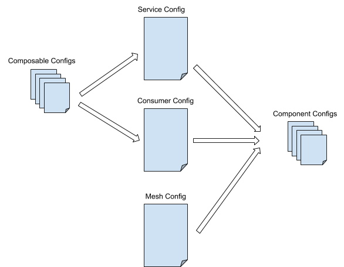
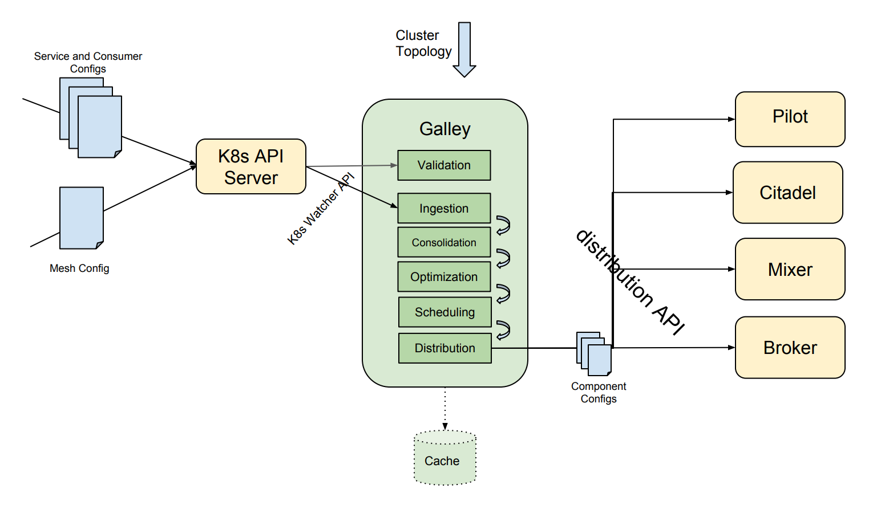
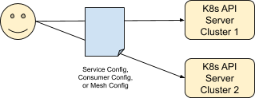
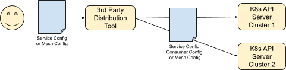
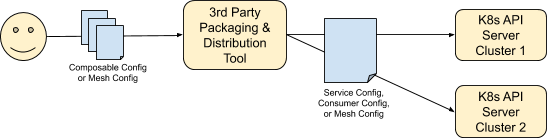
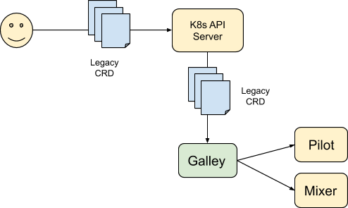
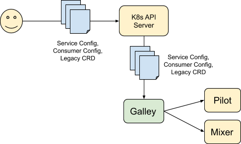
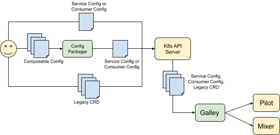
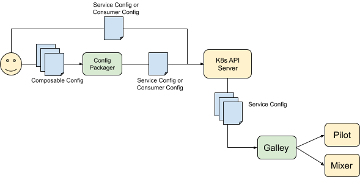

> 备注：内容摘抄自 Istio Config working Group 的文档 [**Config Architecture**](https://docs.google.com/document/d/1rMb7Qr2_QzRXdLXNB_R9fRyVUJgIfWZDCzQm8Bu0ID4/edit#heading=h.7zgnj8bwqfld) 

## 介绍

本文档介绍了Istio的整体配置模型。 我们在这里描述主要组件和一般使用流程，提供一些基本原理，并讨论考虑的替代方法。

还有两个相关文档：

- [config distribution requirements](https://docs.google.com/document/d/1hOFO9XosEEShfLeHaYeI9NvFf-vYgl9j4Rnp_IyBmzA/edit#) 
- [config format requirements](https://docs.google.com/document/d/1N0nPLzXxodDgtRlRHSKNJJ6gmf49LW8rkhs7gpy42rA/edit)

以及两个背景知识：

-  [Istio’s current configuration story](https://docs.google.com/document/d/1PNzYnG0pl5Bubtx-rGwHFWDnBRkrT9upw5mhMA8EpM8/edit) 
-  [Kubernetes resources](https://docs.google.com/document/d/1RmHXdLhNbyOWPW_AtnnowaRfGejw-qlKQIuLKQWlwzs/edit#heading=h.sa6p0aye4ide)

### 配置挑战

Istio严格依赖于Kubernetes的轻量级最终一致性的分布式配置模型。 网格相对于各个服务的行为由许多小的零碎的最终一致的组件级资源描述。 这导致以下问题：

- **紧急状态**。 由于单个服务的配置由许多最终一致的资源捕获，如果运维试图将服务的配置从状态A移动到状态B，其中A和B之间的差异涉及对许多资源的更新，则在A和B之间存在大量的潜在紧急瞬态总系统状态，很难推断。 这些可能导致各种中断或不当行为。
- **手动排序/安排**。 为了避开紧急状态的缺陷，运维必须深入理解不同Istio组件之间的关系，以便配置转换可以分解为更小的可预测步骤，以恰当的顺序执行，同时考虑到最终的一致性约束。 这很困难，乏味且容易出错。
- **无法分步骤更改**。 复杂系统通常很容易以微妙的方式进行错误配置。 例如，在谷歌内部，对多年大小中断的分析表明，大约70％的生产中断是由错误配置问题引起的。 Istio目前没有提供良好的机制来逐步推出整个网格中的配置更改，因此错误的配置可能会几乎瞬时的触发全部服务中断。
- **不好重用**。 Istio在网格中管理大量微服务，但是当前的配置模型有局限，使得难以在整个微服务组中共享公共配置元素。
- **诊断不利**。 当前配置模型由许多小的相互依赖的资源组成，为用户提供的诊断功能极差。 既不静态地观察资源之间的语义和组成错误，通常也不动态发现或报告它们。 “不工作”，然后由用户通过仔细观察，集中注意力，靠经验和运气来弄清楚原因。

### 目标

该架构的目标显然是为了解决上述挑战，以便为我们的用户提供强大而愉悦的配置体验。 配置分发要求和配置格式要求文档阐明了我们正在努力实现的更具体的目标。

## 通用架构

我们将配置问题分成两个不同的互补部分：

- **创作模型**。 允许运维指定系统行为的机制。 配置状态是什么样的，如何在系统中引入，如何观察，如何在服务之间共享等等。
- **分发模型**。 通过运行中的网格进行配置摄取和部署所涉及的机制。

将这两个部分连接在一起的是下面描述的服务配置和消费者文档。 创作模型侧重于生成服务和消费者配置文档的有效方式，而分发模型则侧重于如何将服务和消费者配置文档部署和应用到运行的网格中。

服务和消费者配置文档的概念为我们提供了一个强有力的系统配置交易概念，正如我们将在下面解释的那样，我们可以解决紧急状态，排序和诊断问题。 此外，正如我们将在下面看到的，服务和消费者配置文档对我们的配置部署模型至关重要。

### 配置工作流程

Istio配置体系结构旨在让运维指定和控制网格相对于其中的各个服务和工作负载的行为。 将配置引入到网格中涉及一个工作流，其初始输入是由运维创作的可组合配置文档，其最终输出是面向组件的配置文档：

- **可组合配置**。 关于Istio应如何表现的抽象描述，相对于并支持网格中的服务和工作负载。 这些是小文档，它们组合在一起以形成大型服务配置和消费者配置文档。 组合模型提供了各个配置状态块之间的重用，范围和引用。

- **服务配置**。 用于表示控制网格中单个服务行为的配置状态。 该文档可以手动创作，也可以由一组可组合配置文档直接转换和规范化生成。

- **消费者配置**。用于表示控制网格中单个服务消费者的客户端行为的配置状态。 该文档可以手动创作，也可以从一组可组合配置文档直接转换和规范化生成。

- **网格配置**。 表示对网格而言是全局而不是特定于服务或消费者的配置状态。 这主要集中在低级配置选项上，例如控制缓存大小，端口号等等。

- **组件配置**。 表示传递给网格中各个Istio组件以控制其行为的配置状态。 通过分析定义的服务和消费者配置的总集合来确定该状态，以确定如何编程各个组件。 该分析考虑了单个集群的物理现实，以便可以处理特定于集群的优化，例如分片。 组件配置格式在很大程度上被认为是系统的实现细节，并且运维通常不直接操纵组件配置。 [请注意，对于当前的Istio，运维手动编写此类配置文档。 在这个新架构中，组件配置格式被视为未向运维公开的实现细节。

这种流水线模型提供了各种好处：

- **解耦**。该模型将运维创作的配置与运行时消费的组件分开，从而可以优化面向运维的格式，以实现最大可用性，同时优化组件消耗的效率。

- **正确性**。将可组合配置规范化为单个服务配置，这提供了在将配置数据引入运行系统之前，对配置状态执行各种分析的机会。在扰乱正在运行的Istio系统并可能影响客户之前，可以执行语法检查，语义检查，参照完整性检查，时间检查等。

- **优化**。服务和消费者配置到组件配置之间的转换由网格中存在的服务和消费者配置的总集以及网格的运行时属性和拓扑结构来决定。这为有效优化系统行为提供了各种机会，可以自动为客户提供更高性能和更可靠的体验。

### 分发模式：Galley

如上所述，分发模型涉及摄取服务和网格配置文档。 Galley是我们推出的新组件，提供此功能。 Galley的职责主要是将服务和网格配置转换为组件配置，以及在集群内安排和编排配置分发。

该图展示了分发模型的基本部分：

- **验证/Validation**。 Galley负责在服务配置文档被发送到正在运行的网格中之前进行验证。 验证包括各种形式的分析：
  - **语义/Semantic**。 所有输入必须在语义上有效。 必须正确键入所有值和引用，所有值必须在允许的范围内，等等。
  - **咨询/Advisory**。 Galley根据一组建议验证配置状态，以便检测可疑的使用模式（即配置毛刺）。
  - **比对/Temporal**。 Galley将新的配置状态与先前的配置状态进行比较，以便检测和报告潜在的破坏性变更。

- **生成**。 一旦接受，服务配置文档就会与其他现有服务配置合并，以创建组件配置。 全局简化，去复，整合和优化是此转换过程的一部分。

- **调度和分发**。 Galley调度单个组件配置的分发，以便消除不期望状态的出现（即防止中断）。 调度创建后，Galley会将配置状态分发给集群中的各个组件。

### Galley存储要求

在单租户情况下，Galley很可能是无状态的。 所有组件级配置都可以保存在内存中，并在Galley启动时自动生成。

在多租户环境中，可能会使用Galley来管理多个网格的配置，Galley必然需要存储空间来进行HA节点之间的缓存和共享。

### 创作模型

如上所述，创作模型涉及创建服务和消费者配置文档，要获取Istio需要知道的所有内容，以便管理单个服务或服务消费者。

单个服务或消费者配置文档可能相当大，涵盖服务或消费者行为的许多方面：从路由规则到访问控制策略，再到适配器配置。另外，在单个网格的上下文中，许多服务和消费者通常需要具有类似的配置参数。例如，网格中的所有服务可能都希望使用相同的度量标准集合后端参数，并且所有消费者都希望使用相同的重试语义。

考虑到各个服务和消费者配置文档的规模和冗余，非常希望向运维暴露友好的模型，该模型允许单个服务或消费者配置由较小的可重复使用的部件组成。例如，一个两级分层组合，其中某些状态是每服务的，某些状态是在服务之间共享的：

通过这种方法，服务1的有效服务配置是由其配置状态以及全局范围中的状态组合而成。 并且同样的全局范围状态用作服务2的有效服务配置的一部分。

Istio 1.0提供适量的全局/局部组合，在运行时进行评估。 这种新架构有望提供更早期评估的更丰富的组合模型，从而使运行时行为更简单，更高效。

## 组合解决方案

我们设想的创作模型是灵活的，具有不同的非架构方式来生成服务配置文档。 不同的客户会选择适合他们的产品，我们希望随着时间的推移，社区会出现其他方法。

### 1. 直接创作

这是最常见的创作场景，适用于大多数小型网格。 运维直接编写服务配置文档并将其推送到Kubernetes API服务器。

### 2. 组合创作

随着网格的增长，各个服务的配置存在固有的冗余。 此外，还会出现不同的运维角色，其中每个角色都希望通过某种形式的访问控制来控制服务配置的不同部分。 例如，安全运维可以控制权限，而核心服务运维则关注度量和配额。

为了支持这一点，我们使用离线打包工具提供基本的组合模型：

在此模型中，用户编写一系列小文档，这些文档保存在用户的系统中（例如在源代码控制中）。 然后，用户运行一个工具，将小文档打包成单个服务或消费者配置文档。 最终，通过将服务或消费者配置文档作为资源提交给Kubernetes API服务器，将其引入Istio。

使用源代码控制来存储和管理原始的可组合配置，使运维能够应用细粒度策略：谁可以修改配置状态，谁可以查看和授权这些更改，何时发布更改等。

> 配置包装器和可组合配置不是Istio的架构，只有服务和消费者配置是。 这意味着可以使用格式和工具的替代版本。 例如，您可以想象一个端到端的GUI环境，它允许用户以友好的方式进行配置，并输出现成的服务或消费者配置文档以摄取到Istio中。

## 多集群模型

Galley每群集运行，并期望直接或通过配置包装器为运维生成服务配置文档。 将服务和消费者配置文档从运维的系统获取到多个集群不是配置模型的责任。 有三种基本方法可供运维实现：

### 1. 手动

运维可以手动将单个配置或网格配置文档推送到每个群集。 不愉快，但简单明了：

### 2. 自动

在第二个模型中，用户利用自动化工具将配置文档传递到网格中的所有集群：

### 3. 自动化包装

该模型类似于上面的 2自动，除了分发工具也负责包装。 想象一下，例如，一个系统，运维创建并将可组合的配置和网格配置工件推送到工具中，然后按下按钮以生成服务配置文档，并将它们和网格配置传送到网格中的所有集群：

## 配置推出模型

无论在配置部署之前进行多少静态验证，配置错误总是会漏掉。就像二进制转出通常是逐步完成以便最小化坏二进制文件的影响一样，我们需要在整个网格中逐步部署配置更改，以便最大限度地减少错误配置的影响。

逐步配置推出的粗略方法是将更新的配置状态部署到网格内的组件实例的子集。例如，只有10％的Sidecar和Mixer将使用新配置进行更新，然后是20％，40％，80％和100％。随着部署的推出，任何不良的遥测都会导致瞬间返回旧配置。虽然这种方法可行，但它只适用于具有大量Istio组件实例的非常大的网格。例如，对于只有一个mixer的小网格，这是一个全有或全无的事情。使用两个mixer，风险是如果配置错误，所有流量的50％可能会遇到问题。即使是小网格，我们也希望提供更细粒度的推出。

提供小于一个组件的一次性部署粒度意味着我们必须使用流量分割，因此各个组件必须以某种方式参与部署过程。将服务从配置A转换为配置B时，组件需要使用配置A处理某些流量，而某些流量使用配置B.

服务和使用者配置文档指定自己的部署启动参数。这指定了在正在运行的系统中何时以及如何使用新引入的配置。例如，配置可以指定应该使用的流量百分比，而不是系统已知的前配置版本。其他选择方法可以包括诸如组合使用旧配置和新配置以及其他事物。

当配置在两个版本之间传输时，Galley创建混合组件配置，该配置包含配置状态的相关位的新旧版本。该混合状态被分发给网格中的组件。

当请求进入系统时，Istio将快速确定要为每个请求应用的配置。然后，该决定将遵循请求，使得处理请求中涉及的所有组件将针对每个请求使用一致的配置版本。这个模型是我们如何消除系统中的紧急状态。将始终处理给定请求，就好像系统处于旧状态或新状态，但从不在其间进行说明。

请注意，分阶段展开是可选的。用户可以完全跳过此步骤并推送服务配置文件并安排让它们立即生效。

### 推出范围

推出范围仅限于单个服务或服务消费者。 Istio将确保在单个服务或消费者的上下文中不存在紧急状态条件和排序困难，但不保证跨服务依赖性。

如果需要以某种方式协调对消费者和/或服务的更新，则由运维来协调这些部署。

## 实现策略

我们目前设想在实现此架构的途中有5个不同的Click-Stop。 在Click-Stop之前，请考虑当前模型：

### **Click-Stop 0**：引入Galley

第一个Click-Stop涉及在端到端故事中引入galley。 这是将新组件引入平台的基础工作，并消除了各个Istio组件的Kubernetes依赖性。 Galley读取CRD，然后使用专用协议对Istio组件进行编程。

### **Click-Stop 1: 引入服务和消费者配置**

下一个click-stop引入对服务和消费者配置的支持。 运维现在可以以此格式创作配置。

### Click-Stop 2：引入可组合配置

在此click-stop中，用户可以使用可组合格式来开始创作配置。 运维可以继续使用传统CRD格式，以及直接创作服务和消费者配置文档。

### Click-Stop 3: 删除旧版

在最后的click-stop中，我们删除了对旧版CRD格式的支持。 运维现在必须使用服务或消费者配置或可组合配置来创建配置。

### Click-Stop 4：分阶段推出

在最后一次click-stop中，我们利用架构基础为分阶段配置部署提供端到端支持。