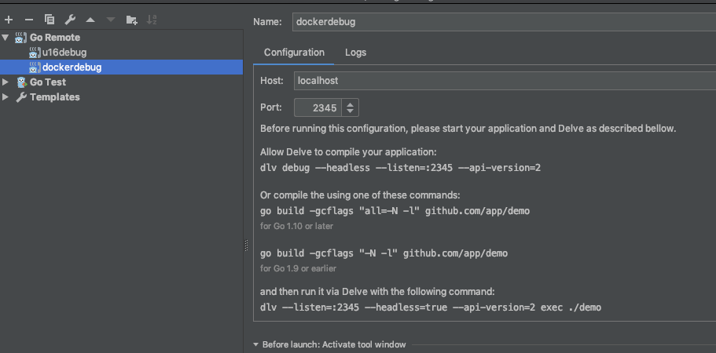

参考Istio官方文档：

https://github.com/istio/istio/wiki/Dev-Guide

### 准备环境

按照要求先准备好golang/docker/kubernetes。

设置环境变量：

TBD


## debug

- 在本地开发阶段可以方便的debug代码，代码更新后，不用重新构建镜像，可以高效的进行debug
- debug环境开箱即用，不需要每个开发人员进行配置

在本地启动container，挂载本地的workspace，docker bash 上去进行dlv

### 使用方式

```
cd $istio_src 
# 挂载本地的src到docker，修改马上生效
docker run -it --security-opt=seccomp:unconfined -p 2345:2345  -v $(pwd):/go/src/istio.io/istio -w /go/src/istio.io/istio reg.docker.alibaba-inc.com/sofastack/meshci-1.11:0.1 bash 

# 登录后对某个UT进行debug，例如xds_test.go 的TestEnvoy func
dlv test --build-flags='pilot/pkg/proxy/envoy/v2/xds_test.go' --headless --api-version=2 --listen=0.0.0.0:2345 -- -test.run ^TestEnvoy$
```

goland通过配置




