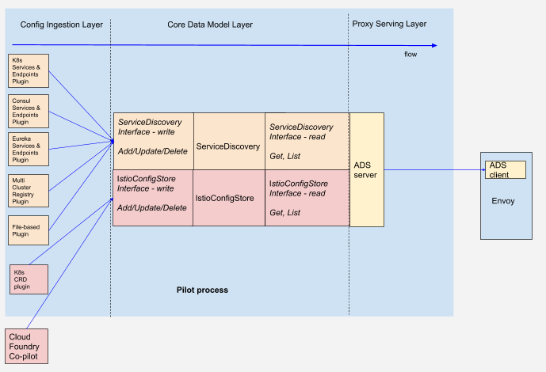

## 提案介绍

Pilot Decomposition 的资料来自：

https://docs.google.com/document/d/1S5ygkxR1alNI8cWGG4O4iV8zp8dA6Oc23zQCvFxr83U/edit#heading=h.a1bsj2j5pan1

2018年6月提出的Proposal，目前状态是 **WIP** 。

```bash
Authors:  Andra Cismaru @andraxylia, Louis Ryan @louiscryan
Contributors: Costin Manolache @costinm, Shriram Rajagopalan @rshiram, Jason Young @ayj, Oz Evren @ozevren, Martin Taillefer @geeknoid
Work-Group:  Networking
Short self link: https://goo.gl/qAsEQx
go/pilot-decomposition
Reviewers: add your name here
Status: WIP | In Review | Approved | Obsolete
Created: 06/2018
Last update: 06/2018 (in progress)
Release Version: 
```


## 提案内容

来自原文。

### 介绍

本文件提出了一种渐进式的Pilot重构方法，旨在解决许多结构性问题：

- Pilot的测试难度过高。它需要依赖K8S Apiserver才能编写更复杂的单元或简单的集成测试。
- 在横跨Pilot，Mixer和Citadel处理K8S CRD的变化时我们的逻辑有些混乱。 K8S集成，资源验证和API版本控制等常见问题并不共享共同的实现。恢复Galley的提议主要是因为明显需要改进面向用户的API体验。
- 在Pilot中使用K8S API客户端是臃肿的来源，并且代表了生产风险。将这种风险转移到 Galley 而将网络控制平面与其隔离，应该有助于性能和稳定性。
- Pilot，Kubernetes和其他平台之间的契约不明确。即使我们不需要它，我们也隐含地完全使用K8S API。
- 为Pilot编写扩展需要开发人员使用我们的构建过程，这已被证明是合作伙伴采用的障碍。这类似于最近Mixer中的架构转换，出于同样的原因使用进程外适配器。

从广义上讲，本文档提出了一个最终状态，其中：

- 通用的面向用户的API问题，如K8S集成，CRD管理，资源验证，访问控制模型和升级，进入了 Galley
- Pilot 为 Galley 消费的网络问题定义了一个正式且精确的协议。 该合同将使用 Protobuf 指定。
- 我们将现有的扩展（如Consul，Zookeeper和我们自己的测试驱动程序）移动到使用上述API的进程外模型。

本文档的目的是概述如何实现目标的增量计划。

### 当前设计

Pilot目前由三层组成：

1. 配置获取层

	- 包括几个进程内特定平台插件：

		- 服务和端点注册管理机构 - Kubernetes，Consul，Eureka
		- Kubernetes CRD插件，用于其余配置资源 - Gateway，VirtualService， DestinationRules，ServiceEntries，（auth）Policy
		- Kubernetes的多集群注册表
		- 基于文件的配置插件
		- 内存配置插件
		- Cloud Foundry服务注册表

	- 包括一个进程外适配器 CloudFoundry Co-pilot，它部分地从CloudFoundry路由转换为类似于Pilot的配置，但不完全相同; 转换的其余部分由进程内 CloudFoundry 服务注册表完成

2. 核心数据模型层

    - 包含主数据结构的内存副本（可能不是很明显，但 kube-client 维护所有 Kubernetes 资源的进程内缓存）
    - 由两个独立的存储组成，用于服务和端点的ServiceDiscovery存储，以及用于CRD的IstioConfigStore
    - 每个存储都将自己的写入接口Add/Update/Delete公开为Config Ingestion Layer调用的通知处理程序
    - 每个存储都通过自己的代理服务层暴露调用的读取接口Get/List

3. 代理服务层

	- 负责通过Envoy的Aggregated Discovery Services gRPC协议计算配置并向Envoy推送

Pilot当前设计的概念图如下所示：



我们建议通过一组定义明确且可接受的API来配置Pilot，我们将其方便地称为Mesh Configuration API（MCA）（欢迎快速命名建议！）。

幸运的是，我们已经为这个API定义了很好的模式，因为我们已经使用protobuf作为我们在Kubernetes中为CRD定义模式的机制; 请参阅版本0.8中的 istio/api/networking v1alpha3，并且 istio/api/authentication 允许完全配置Pilot的当前功能，当前支持：

- Gateway，VirtualService，DestinationRule，Auth Policy 有等效的API。
- 可以使用ServiceEntry API配置服务和端点。 当前这个API用于通过CRD的显式配置来描述远程集群中的服务和端点，并且可以用于以统一的方式表示所有服务和端点。

预计API将发展为支持未来的功能和扩展需求，并且更新的粒度需要改变; 本文档的重点不在于API的实际体现，而在于使用MCA配置Pilot的原理和机制。

Pilot应该能够从多个源接收配置，只要配置在逻辑上彼此隔离（即，除了Exception之外没有合并），并且限定在组织/网络层次结构中的不同非重叠域。

### Mesh Configuration Protocol (MCP)

为了承载Mesh Configuration API，我们建议使用类似于Envoy的ADS协议的定义良好的gRPC双向流协议，该协议聚合和传输通用异构资源。 我们方便地命名该协议为Mesh Configuration Protocol（MCP）。 Pilot将充当MCP客户端，注册多个MCP服务器。

### 可扩展的架构

MCA将使我们能够从基于插件的架构转变为一种架构，其中配置服务器和适配器运行在MCP服务器的进程外，并通过MCA与Pilot集成。 具有严格延迟要求的适配器可与Pilot并置，同时仍使用MCA。

### 统一核心数据模型接口

到目前为止，提案涉及Config Ingestion Layer。 利用独有的MCA API集，我们可以删除核心数据模型层中的二分法，并将现有的核心数据模型层接口ServiceDiscovery和IstioConfigStore统一/封装到名为CoreDataModel的通用接口中。

核心数据模型层和代理服务层的进一步优化是可能的，并且超出了本文档的范围。

### 迁移路径

现有的Pilot插件可以选择成为进程外适配器或迁移到能够聚合多个插件的配置服务器。可能会有以下例子：

- Kubernetes插件迁移到Galley
- 基于文件的插件迁移到Galley，也作为独立的适配器在测试框架中使用。
- Consul迁移到进程外
- Eureka迁移到进程外
- 多群集注册表迁移到Galley或转移到Pilot Federation/Pilot链

### 未来整合问题

引入MCA为集成和分发开辟了各种可能性。 本文档无意完全探索这些选项，但一些更明显的选项包括：

- 让Pilot远程到K8S的能力
- 支持或合并多个配置源的能力

## 讨论信息

