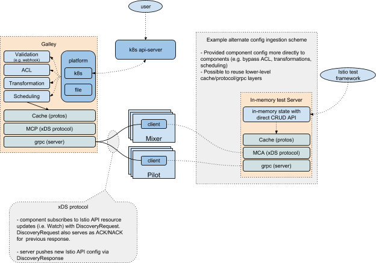

## 提案介绍

Mesh Configuration Protocol 的资料来自：

https://docs.google.com/document/d/1o2-V4TLJ8fJACXdlsnxKxDv2Luryo48bAhR8ShxE5-k/edit#

2018年4月23号提出的Proposal，目前状态是 **Approved** 。

```bash
Authors:  jasonyoung@google.com
Work-Group:  config
Short self link: https://goo.gl/EJu5hg
Contributors: @andraxylia, @ozevren, @geeknoid
Reviewers: 
Status: WIP | In Review | Approved | Obsolete
Created: 04/23/2018
Release Version: N/A
Approvers: mtail@google.com [ ], ozben@google.com [x] 
```


## 提案内容

来自原文。

### 目的
我们需要一个有凝聚力的故事，关于组件如何从Galley接收配置，在整个产品中尽可能多地使用共享代码和技术。 Istio 组件包括 Mixer，Pilot，Citadel 和 Pilot-agent。 有关高级概述，请参见 Istio Config Architecture。

### 问题

Pilot 和 Mixer 组件在进行配置时和底层平台紧密耦合。例如需要 k8s api-server。很难独立测试组件。扩展和集成到不同的环境需要更改每个组件的代码。

验证，ACL，版本控制和schema升级在组件之间不存在和/或不一致。这些问题应该与运行时组件大幅解耦，并在配置分发之前进行处理。

配置分发过于粗糙。整体配置输入空间可能非常大。无法将配置空间的子集分发到组件实例的子集。

组件配置分布在 CRD，ConfigMap 和二进制标志上。 ConfigMap 和 flag 通常需要重新启动组件或 pod 以采用新配置。使用一种一致的方法来获取所有istio运行时配置是可取的。

组件配置消费效率低下。 K8s CRD作为JSON存储和传输。组件在运行时使用protobuf。每个组件都会产生YAML/JSON到Proto转换的CPU/内存成本。集中转换是可取的。

### 非目标

面向创作模型的用户继续依赖于k8s api-server进行配置。 此doc仅解决组件如何接收其配置。

### 提案



- 使用GRPC双向流将组件更新推送到组件。 此客户端/服务器协议是基于Envoy的xDS gRPC协议的订阅模型。 我们可以给它一个不同的名称，以避免混淆，例如 Mesh Configuration Protocol（MCP）。组件订阅相关的资源类型。
- MCP携带 istio/api 中定义的现有 Istio API，例如 istio/api/networking，istio/api/authentication，istio/api/mesh。 资源作为protobuf运输。 元数据（例如名称）必须在资源中直接编码为子消息。
- Galley实现MCP服务器。 引入适配器模型，从而可以插入配置提取。 最初支持对CRD和基于文件监视的支持。 通过适配器提取的配置映射到 xDS watch 订阅。 适配器最初可以在进程中，也可以替代地移到进程外。
- 可以创建备用MCP服务器实现以简化测试和本地开发。 合作伙伴还可以直接使用MCP与istio运行时组件集成。

### 迁移路径

从Pilot的角度写了一个类似的提议 - 见  [Decomposing Pilot](https://docs.google.com/document/d/1S5ygkxR1alNI8cWGG4O4iV8zp8dA6Oc23zQCvFxr83U/edit#heading=h.x9snb54sjlu9) 。 Mixer和其他Istio组件可以逐渐转移到新模型。 最终意图是：

- Istio组件与平台无关，通过MCP消费Istio配置。
- Galley提供与Kubernetes完全集成的MCP服务器实现。 Galley负责配置验证，增强ACL，版本控制，schema升级等。
- 平台合作伙伴可以使用同一组API（MCP）集成Pilot，Mixer等

希望逐步向这个新模型移动。 为此，现有的CRD将被保留，并且Galley将使用每资源 xDS 1对1的订阅 k8s CRD。 可以选择配置Galley（通过feature flag）来执行此功能。 可以选择配置组件（通过feature flag）来订阅来自Galley的配置更新（对比直接连接k8s）。

### 开放事宜

以下开放事宜将逐步处理。

- 所有Istio API都需要嵌入式元数据。 xDS资源交付单位是protobuf。 每个protobuf必须完全自我描述。 当前类型缺少元数据（例如，名称，名称空间，标签）。
- 声明性验证。 功能域应该能够定义验证模式并让其他人（即Galley）验证它。 应相应地注释Istio API schema。
- 增强用于Istio资源的ACL模型。 例如 network API 应该通过网络名称（host）的所有权进行ACL
- 在Galley和运行时组件之间验证Auth{n,z} 。 Strawman：mTLS for authn。 authz需要单独的政策讨论

## 附录

### （MCP）xDS 协议概述

以下是适用于Istio配置的Envoy xDS协议的简短摘要。 Istio组件是gRPC客户端。Galley是gRPC服务器。组件通过启动gRPC流并发送 ConfigRequest protobuf 通过订阅来请求配置。Config在 ConfigResponse protobufs 中提供。 客户端总是在收到 ConfigResponse 后发送 ConfigRequest，而 Galley 仅在新配置可用时发送 ConfigResponse，由此来实现“推送”语义。

虽然Envoy具有发现服务(EDS/CDS/RDS/LDS/等）以及聚合服务（ADS），但Istio配置分发服务可以按组件类型（Pilot，Mixer，Agent等）或单个聚合服务来确定尺度。 有关协议的更全面说明以及如何处理ACK/NACK和版本控制，请参阅xDS协议文档。

### 考虑的替代方案

Galley Watch API。 使用googleapis watcher API将声明性配置数据流式传输到组件。 组件会观察与其所需配置状态对应的命名实体。 该实体对应于元素集合，以允许跨更新的组合和重用。 反过来，组件接收有序且可靠的配置状态流。

## 讨论信息

#### Martin Taillefer（6月8号）：

我认为我们应该咬紧牙关并使Galley成为MCP客户端本身，以便可以使用与其他组件相同的协议进行编程。

具体来说，所有使我们的组件和k8测试变得困难的东西也将适用于Galley。 让我们尽可能地将Galley与k8s分开。

适配器，即使它们在进程中，也可以使用MCP与Galley正确对话。

#### Jason Young （6月9号），proposal的提出者：

平台适配器和核心Galley逻辑之间应该有一个定义良好的API，但我不确定MCP是最佳候选者。像下面这样的东西可以实现更丰富的平台集成。我们可以为此定义适当的gRPC服务等，以便更容易测试。

type GalleyCore interface {
// Validation and ACL check. 
// Invoked during
// platform admission phase
Allowed(*Resource) error

// Invoked after
// resource is persisted
// in platform config storage. 
Schedule(*Resource) error

// Async status channel.
Status() <-chan *Resource
}

我不确定前三个阶段如何干净地映射到MCP。我们需要为每种类型的Allowed()和Schedule() 单独设置观察。 Schedule() 的返回状态可能应该是较低级别的缓存/分发代码，已接受计划资源而不是已交付的资源。我们需要另一个异步API来指示远程组件是否对资源更新进行ACK/NACK，以便我们可以更新CRD状态并生成k8s事件。

####  Jianfei Hu （9月1号）

这有点违反了它试图解决的问题＃1：“例如需要k8s api-server。” 如果平台不可知不是目标，问题＃1应该重写。

####  Jason Young （9月1号）

更新了措辞，使其更清楚，“组件”指的是Pilot和Mixer。 作为用户创作配置的k8s集成点，Galley仍然依赖于k8s api-server。

####  Jianfei Hu （9月1号）

Citadel 隐含了对 k8s apiserver 的依赖：它监视k8s服务帐户的创建/删除，并为它们创建密钥/证书。 对此我们没有istio/api。

我们是否可以将这部分k8s服务帐户逻辑移至galley，并提出从Galley向Citadel提供的一些资源（应该是微不足道的/trivial) ）？

通过这种方式，Citadel本身也成为k8s的不可知论者。

棘手的部分变成了Galley如何验证发往Citadel的这些安全关键信息......

从短期来看，我们可以让Galley使用Citadel的自签名密钥/证书（无论如何都是在istio-system命名空间......）。 从长远来看，可能需要更好的故事......

#### Tao Li（9月1号）

我想我们正在走 SDS 方向，那么我们还需要 Galley 吗？

### Oliver Liu（9月1号）

我认为使用SDS，Citadel不需要观察 apiserver。 但是我们仍然需要k8s的安全功能：

1. 存储签名密钥和证书。
2. 存储ingress的外部密钥和证书。

如果我们使用Galley来存储它们，那么Galley需要成为系统中信任的根源。 我们需要调查此路径中的安全问题。

#### Jianfei Hu （9月1号）

对不起，后续问题。

虽然这个提议只是为了让 Pilot/Mixer 不依赖于 apiserver，但我确实看到其他的 Galley 文档提到它将支持基于Istio资源的文件观察。 我们首先优先考虑 k8s 集成。

是对的吗？

#### Jason Young （9月1号）

k8s是优先考虑的事情。

基于文件的观察可能会被添加，因为可以用于更轻量级的集成测试。

从理论上讲，我们可以让配置获取做到完全可拔插，通过MCP本身从另一个插件/服务器使用Galley消费配置（参见下面Martin的评论）。 但是，该插件/服务器将成为我们将关注的k8s平台集成点。

####  Jianfei Hu （9月1号）

关于这种低效率成为一个真正的问题，有任何参考/数据？（指文中的 组件配置消费效率低下）

 #### Jason Young （9月6号）

这在 1.0.x版本扩展 Pilot 时是一个主要问题。 一些低效率被移除，但CRD仍然是JSON编码的，Pilot必须处理转换为proto。

####  Jianfei Hu （9月7号）

是的。 但这仅适用于误用的flags / configmap。

提供运行时可配置是以复杂性为代价的，有时甚至是不可行的。

与本文档没有直接关系，提供指导Istio dev在哪里引入选项，二进制标志或其他地方将会很有意义的。

### Jason Young （9月11号）

k8s组件配置设计文档有一般性的合理指导 - 请参阅 https://goo.gl/opSc2o。

对于强类型配置，我们会使用类似MCP（甚至基于文件的配置）而不是CRD，来避免组件硬性依赖于k8s。