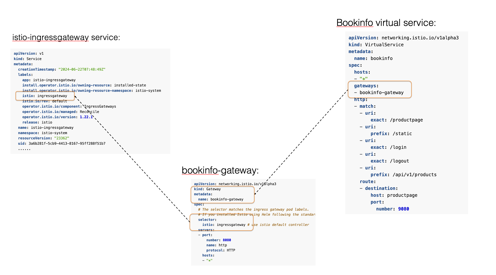
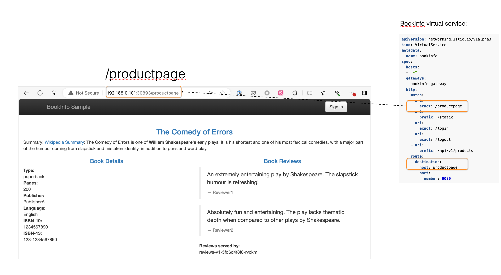
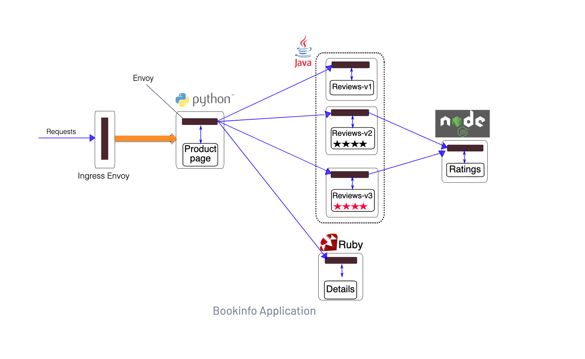

参考官方文档：

- https://istio.io/latest/docs/examples/bookinfo/#determine-the-ingress-ip-and-port

## 背景

在前面的实践中，为了能够在k8s外部访问 bookinfo 的 production page 页面，我们其实已经部署了 bookinfo 的 gateway。

```bash
k apply -f samples/bookinfo/networking/destination-rule-all.yaml
k apply -f samples/bookinfo/networking/virtual-service-all-v1.yaml
```

我们先来看看具体做了什么：

```bash
kubectl apply -f samples/bookinfo/networking/bookinfo-gateway.yaml
```

命令的输出是:

```bash
gateway.networking.istio.io/bookinfo-gateway created
virtualservice.networking.istio.io/bookinfo created
```

打开这个 bookinfo-gateway.yaml 文件：

```bash
vi samples/bookinfo/networking/bookinfo-gateway.yaml
```

可以看到有一个名为 bookinfo-gateway 的 "Gateway":


```yaml
apiVersion: networking.istio.io/v1alpha3
kind: Gateway
metadata:
  name: bookinfo-gateway
spec:
  # The selector matches the ingress gateway pod labels.
  # If you installed Istio using Helm following the standard documentation, this would be "istio=ingress"
  selector:
    istio: ingressgateway # use istio default controller
  servers:
  - port:
      number: 8080
      name: http
      protocol: HTTP
    hosts:
    - "*"
```

和一个名为 bookinfo 的 VirtualService：


```yaml
apiVersion: networking.istio.io/v1alpha3
kind: VirtualService
metadata:
  name: bookinfo
spec:
  hosts:
  - "*"
  gateways:
  - bookinfo-gateway
  http:
  - match:
    - uri:
        exact: /productpage
    - uri:
        prefix: /static
    - uri:
        exact: /login
    - uri:
        exact: /logout
    - uri:
        prefix: /api/v1/products
    route:
    - destination:
        host: productpage
        port:
          number: 9080
```

## gateway之间的关系

梳理一下gateway之间的关系，也就是 bookinfo 相关的专有的 gateway 信息时如何被挂载到 istio 默认的通用 gateway 上的。

这里面有三个实体：

- 名为 istio-ingressgateway 的 ingress gateway，这是安装 istio 时自带的通用 gateway
- 名为 bookinfo-gateway 的 "Gateway"，这是 bookinfo 专用的
- 名为 bookinfo 的 "VirtualService"，这是 bookinfo 专用的

查看 istio-ingressgateway service 的 labels：

```bash
kubectl get svc istio-ingressgateway -n istio-system -o yaml
```

```yaml
apiVersion: v1
kind: Service
metadata:
  creationTimestamp: "2024-06-22T07:48:49Z"
  labels:
    app: istio-ingressgateway
    install.operator.istio.io/owning-resource: installed-state
    install.operator.istio.io/owning-resource-namespace: istio-system
    istio: ingressgateway
    istio.io/rev: default
    operator.istio.io/component: IngressGateways
    operator.istio.io/managed: Reconcile
    operator.istio.io/version: 1.22.1
    release: istio
  name: istio-ingressgateway
  namespace: istio-system
  resourceVersion: "23362"
  uid: 3a6b281f-5cb9-4413-8167-95ff288f51b7
  ......
```

这里就能看到 istio-ingressgateway 的 label 中有 "istio: ingressgateway" 的内容。

而在前面我们为 bookinfo 创建的名为 bookinfo-gateway 的 "Gateway"，它的定义如下：


```yaml
apiVersion: networking.istio.io/v1alpha3
kind: Gateway
metadata:
  name: bookinfo-gateway
spec:
  # The selector matches the ingress gateway pod labels.
  # If you installed Istio using Helm following the standard documentation, this would be "istio=ingress"
  selector:
    istio: ingressgateway # use istio default controller
  servers:
  - port:
      number: 8080
      name: http
      protocol: HTTP
    hosts:
    - "*"
```

这意味着 bookinfo-gateway 这个 Gateway 会通过上面的这个 selector 匹配到 istio 默认安装的名为 istio-ingressgateway 的 virtual service，从而使用 istio 默认的 ingress gateway。




## 请求处理的完整过程

我们来从浏览器发出请求，访问这个 URL 开始，看请求是如何路由的。

首先，原始请求是这样：

http://192.168.0.101:30893/productpage 

其中 192.168.0.101 是部署k8s的节点（node），30893 是 node port，"/productpage" 是 URI。

### 步骤1: 外部请求进入istio-ingressgateway

我们在之前部署 istio 时，istio 自带了一个名为 istio-ingressgateway 的 service，这是 istio 默认的 ingress gateway：

```bash
kubectl get svc istio-ingressgateway -n istio-system
```

输出为：

```bash
NAME                   TYPE       CLUSTER-IP     EXTERNAL-IP   PORT(S)                                                                      AGE
istio-ingressgateway   NodePort   10.102.56.34   <none>        15021:30900/TCP,80:30893/TCP,443:31534/TCP,31400:30798/TCP,15443:31954/TCP   3d17h
```

> 注意：这里 istio-ingressgateway 的 TYPE 是 NodePort，这是在部署 istio 时，为了方便访问，将默认的 LoadBalancer 修改为 NodePort。

找到 "80:30893/TCP"，这说明当前 pod 的 80 端口会被映射到当前节点（node）的 30893 端口。

因此，我们使用这个 URL 进行访问时：

http://192.168.0.101:30893/productpage

请求会访问 IP 地址为 192.168.0.101 的节点的 30893 端口，然后被映射到 istio-ingressgateway 所在 pod 的 80，这样请求就进入到了 istio-ingressgateway 的 80 端口。


### 步骤2: 请求匹配到目标服务

bookinfo 的 VirtualService：

```yaml
  http:
  - match:
    - uri:
        exact: /productpage
    - uri:
        prefix: /static
    - uri:
        exact: /login
    route:
    - destination:
        host: productpage
        port:
          number: 9080
```

和 productpage 页面的匹配：



匹配之后请求就被要求路由到目的地 "host: productpage"

### 步骤3: Ingress 将请求转发给目标服务



Ingress 随后将请求转发给到 productpage 服务。

注意，这里的 Ingress Gateway，也是基于 envoy 的。